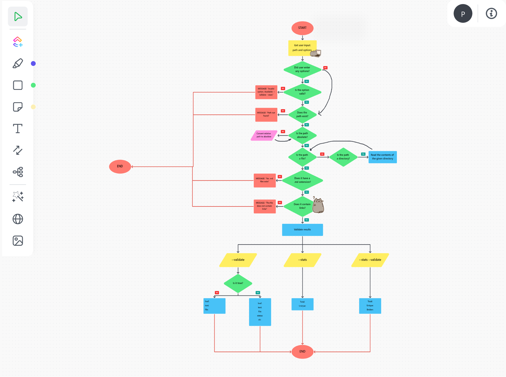

# Markdown Links


***

## Contents

* [1. Introduction](#1-introduction)
* [2. Summary](#2-summary)
* [3. Objectives](#3-objectives)
* [4. Project Plan](#4-project-plan)
* [5. Installation](#5-installation)
* [6. Functionality](#6-functionality)


***

## 1. Introduction

[Markdown](https://en.wikipedia.org/wiki/Markdown) is a lightweight markup language for creating formatted text using a plain-text editor. [John Gruber](https://en.wikipedia.org/wiki/John_Gruber) and [Aaron Swartz](https://en.wikipedia.org/wiki/Aaron_Swartz) created Markdown in 2004 as a markup language that is appealing to human readers in its source code form. Markdown is widely used in blogging, instant messaging, online forums, collaborative software, documentation pages, and readme files.

These `Markdown` files usually contain _links_ that are often broken or no longer valid. The latter greatly undermines the value of the information that is intended to be shared.

This project/challenge proposed by Laboratoria consists of creating a tool using [Node.js](https://nodejs.org/) which reads and analyzes files with `Markdown` format. The goal is to verify the links they contain and show the user some statistics.

## 2. Summary

This is a Node.js library that checks and validates URL links in one or several markdown (*.md) files. Furthermore, it can either be used through the Command Line Interface (CLI) or imported as a module.

## 3. Objectives
### General Objective
* Create a Node.js libreary that checks and validates URL links in one or several markdown files which can be used through the Command Line Interface (CLI) or imported as a module.

### Specific Objectives
* Create a flowchart to better visualize what needs to be done and plan tasks and goals in Github Projects.
* Create a recursive function that loops through all the files that a path points to.
* Send a promise as the library's return value.

## 4. Project Plan
### Flowchart
* Below you can see the workflow to follow to create the library.




## 5. Installation

Once your project is initialized, you must execute the following command from your console:

```
npm i mdlinks-palvarado
```
o
```
npm install https://github.com/prisalvarado18/DEV002-md-links.git
```


## 6. Functionality

### 1) JavaScript API

The module can be **imported** into other Node.js scripts and provides the following interface:

#### `mdLinks(path, options)`

##### Arguments

* `path`: **Absolute** or **relative** path to the file or directory.
If the path passed is relative, it resolves as relative to the directory
where node is called from - _current working directory_).
* `options`: An object with **only** the following property:
   - `validate`: Boolean that determines if you want to validate the links found.

##### Return value

The function **returns a promise** (`Promise`) that **resolves to an array**
(`Array`) of objects (`Object`) where each object represents a link and contains the following properties:

With `validate:false` :

* `href`: Found URL.
* `text`: Text that appears within the link (`<a>`).
* `file`: Path where the link was found.

With `validate:true` :

* `href`: Found URL.
* `text`: Text that appears within the link (`<a>`).
* `file`: Path where the link was found.
* `status`: HTTP response status code.
* `ok`: `fail` message on failure or `ok` on success.

#### Example (results as comments)

```js
const mdLinks = require("md-links");

mdLinks("./some/example.md")
  .then(links => {
    // => [{ href, text, file }, ...]
  })
  .catch(console.error);

mdLinks("./some/example.md", { validate: true })
  .then(links => {
    // => [{ href, text, file, status, ok }, ...]
  })
  .catch(console.error);

mdLinks("./some/dir")
  .then(links => {
    // => [{ href, text, file }, ...]
  })
  .catch(console.error);
```

### 2) CLI (Command Line Interface)

The executable of this program is executed via the **terminal** as follows:

`md-links <path-to-file> [options]`

For instance:

```sh
$ md-links ./some/example.md
./some/example.md http://something.com/2/3/ Link to something 
./some/example.md https://another-example.net/some-document.html Some document
./some/example.md http://google.com/ Google
```
#### Options

##### `--validate`

If the user enters the `--validate` option, the module makes an HTTP request to find out whether the link is working or not. If the link results in a redirection to a URL that answers ok, then the link is considered as ok.

For instance:

```sh
$ md-links ./some/example.md --validate
./some/example.md http://something.com/2/3/ ok 200 Link to something
./some/example.md https://other-example.net/some-document.html fail 404 Some document
./some/example.md http://google.com/ ok 301 Google
```

In this case, the _output_ includes the word `ok` or `fail` after the URL, as well as the received response' status to the HTTP request to the entered URL.

##### `--stats`

If the user enters the `--stats` option, the output is a text with basic statistics on the links.

```sh
$ md-links ./some/example.md --stats
Total: 3
Unique: 3
```

The user can also combine `--stats` and `--validate` to get statistics that need the validation results.

```sh
$ md-links ./some/example.md --stats --validate
Total: 3
Unique: 3
Broken: 1
```